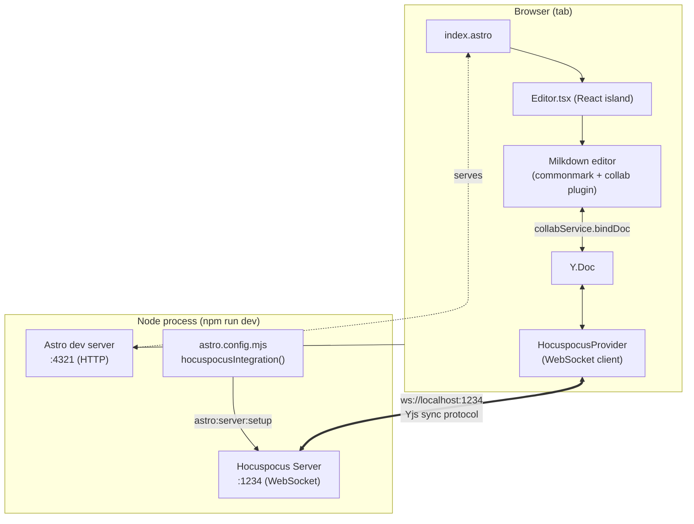

# Architecture

This is a single-package prototype combining an Astro app (client) with an
in-process Hocuspocus server (collaboration backend), connected via Yjs.

## Overview

## Components

- **`astro.config.mjs`** — defines a small custom Astro integration
  (`hocuspocusIntegration`) that hooks into `astro:server:setup` and starts
  the Hocuspocus server in the same Node process as `astro dev`. This is why
  a single `npm run dev` boots both the web app (port 4321) and the
  collaboration server (port 1234).

- **`src/server/hocuspocus.js`** — creates and starts the `@hocuspocus/server`
  `Server` instance (in-memory, no persistence extension configured yet).
  Exported as `startHocuspocus()` so the integration can call it once.

- **`src/pages/index.astro`** — the single page of the prototype. Renders the
  `Editor` component as a client-only React island (`client:only="react"`),
  since Milkdown/Yjs need the browser's `WebSocket`/DOM APIs and shouldn't be
  server-rendered.

- **`src/components/Editor.tsx`** — sets up the collaborative editor per
  browser tab:
  1. Creates a local `Y.Doc()`.
  2. Opens a `HocuspocusProvider` pointed at `ws://localhost:1234`, room name
     `"milkdown-prototype"`, bound to that doc.
  3. Creates a Milkdown `Editor` with `commonmark` (markdown parsing/schema),
     `nord` (theme), and `collab` (the Yjs-backed collaboration plugin).
  4. Binds Milkdown's collab service to the `Y.Doc` and to the provider's
     awareness (cursors/presence), then connects.
  5. On first sync, seeds the doc with a welcome template only if it's empty
     — so reconnecting clients don't stomp on existing content.
  6. Cleans up the editor, provider, and doc on unmount.

## Data flow (why it's "live" across tabs)

1. Each browser tab holds its own `Y.Doc`, kept in sync with the others via
   Yjs CRDT updates.
2. `HocuspocusProvider` ships those updates to the Hocuspocus server over
   WebSocket and receives updates from other connected clients in the same
   "document" (`milkdown-prototype`).
3. Milkdown's `collab` plugin mirrors ProseMirror editor state into the
   shared `Y.Doc` (and vice versa), so keystrokes in one tab appear in all
   tabs subscribed to the same document name.
4. Awareness (cursor position/presence) is synced the same way via
   `provider.awareness`.

## Current limitations (prototype scope)

- **No persistence** — the Hocuspocus server holds document state only in
  memory; restarting the dev server clears all documents. Adding
  `@hocuspocus/extension-sqlite` (or another storage extension) would fix
  this.
- **Single hardcoded room** (`"milkdown-prototype"`) — there's no
  routing/multi-document support yet.
- **No auth** — any client that can reach the WebSocket port can join and
  edit the document.
