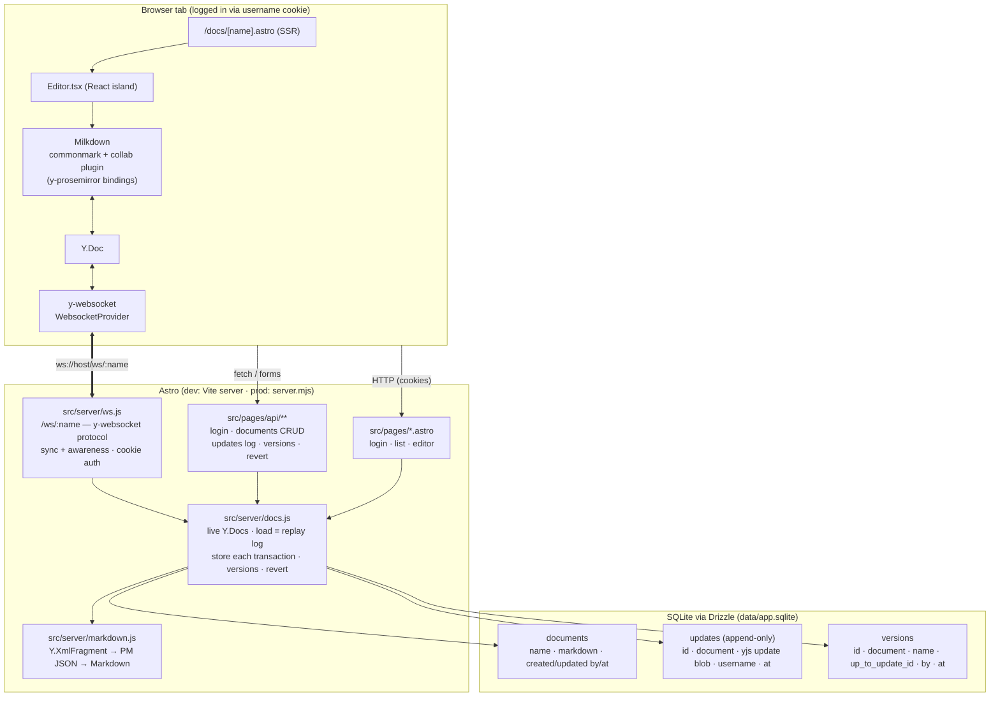

# Architecture

Single Astro project that is both the web app **and** the collaboration backend for Milkdown.
No Hocuspocus: the WebSocket sync endpoint, persistence, transformation to Markdown, versions and a
document REST API are implemented directly on Yjs primitives inside Astro.

## Overview

## Request paths

- **Login** — `POST /api/login {username}` sets a `username` cookie (prototype-grade "auth"). Pages redirect to `/login` without it; API returns 401; the WebSocket upgrade is rejected with 401.
- **Editing** — the browser opens `ws://…/ws/<name>`. `ws.js` runs the standard y-websocket protocol (`y-protocols/sync` + `awareness`) against the live `Y.Doc` from `docs.js`. The connection's origin object carries the username, so every `doc.on("update")` from that socket is stored as **one row in `updates` with that username**.
- **Transformation** — after each change (debounced 500 ms) the server converts the Yjs `prosemirror` fragment to ProseMirror JSON (`y-prosemirror`) and then to Markdown (`markdown.js`), and writes it to `documents.markdown` with `updated_by`. `GET /api/documents/:name?format=markdown` returns exactly that; `?format=json` the PM JSON.
- **Loading** — no state blob is stored. A document is loaded by replaying all its `updates` rows in id order into a fresh `Y.Doc` (`Y.applyUpdate`). Any historical state is `?at=<updateId>` — replay up to that id.
- **Versions** — a version is a named pointer `up_to_update_id` into the log. Revert clones the fragment content of the reconstructed old doc into the live doc inside one Y transaction attributed to the caller — it is a **new** log entry; history is never rewritten.

## Files

| Path | Role |
|---|---|
| `astro.config.mjs` | `output: server`, node adapter (middleware), integration attaching the WS server to Vite's http server in dev |
| `server.mjs` | production entry: http server = static + SSR handler + `attachWebSocketServer` |
| `src/server/db/schema.js` | Drizzle schema (`documents`, `updates`, `versions`) |
| `src/server/db/index.js` | better-sqlite3 + Drizzle instance (globalThis singleton), creates tables |
| `src/server/docs.js` | document manager: live docs, replay, per-transaction store, markdown persist, versions, revert |
| `src/server/markdown.js` | Yjs → PM JSON → Markdown for Milkdown's commonmark node set |
| `src/server/ws.js` | y-websocket protocol server, cookie auth, per-user origins |
| `src/server/auth.js` | cookie parsing / name validation |
| `src/pages/api/**` | REST API (see README) |
| `src/pages/{login,index}.astro`, `src/pages/docs/[name].astro` | UI |
| `src/components/Editor.tsx` | Milkdown + `y-websocket` provider + awareness (user name/colour) |
| `Containerfile` | multi-stage build → `node server.mjs`, `/app/data` volume |

## Database portability

Drizzle is dialect-agnostic: this prototype uses `drizzle-orm/sqlite-core` + `better-sqlite3`.
Moving to Postgres = swap the column builders to `drizzle-orm/pg-core` (`bytea` for the update blob), the driver to `drizzle-orm/node-postgres`, and manage schema with `drizzle-kit`. The document manager only uses Drizzle's query builder, so it is unchanged.

## Known limitations

- Login is a cookie with a username — no passwords, no sessions; fine for the prototype, not for the internet.
- Load-by-replay is O(#updates). For long-lived docs add periodic compaction (`Y.mergeUpdates` of a prefix into one row, or a cached state row) — the log stays the source of truth.
- Markdown serializer covers the commonmark preset (headings, paragraphs, lists, quotes, code, hr, images, strong/emphasis/code/link). GFM tables etc. would need extending.
- Single node process; scaling out needs a shared pub/sub between WS instances (y-redis pattern).
